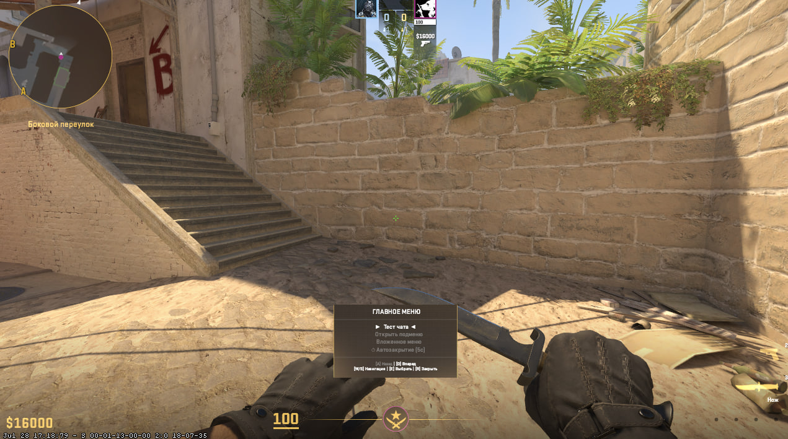

# Menus Plugin for CS2 (Plugify)

## Requirements

* Go (1.20+)
* Docker (for building)
* Task (Taskfile runner)

## Build Instructions

This project uses Task for automation. To build the plugin, run:
```
1. task gen
2. task bind
3. task build
```

## Install to server 
```
1. Download latest release
2. Move the addons folder to the server
```

## How Usage

To utilize this menu system in your own custom CS2 plugins, declare it as a dependency inside your plugin's .pplugin manifest file:

```
"dependencies": [
    {
        "name": "menus"
    }
]
```

```
package plugin

import (
	"fmt"

	"__module_name__/pkg/bindings/menus"
	s2sdk "github.com/fr0nch/go-plugify-s2sdk/v2"
)

func (p *Plugin) start() error {
	flags := s2sdk.ConVarFlag_LinkedConcommand | s2sdk.ConVarFlag_Release | s2sdk.ConVarFlag_ClientCanExecute
	s2sdk.AddConsoleCommand("testmenu", "Open Optimized Menu", flags, p.handleTestMenuCommand, s2sdk.HookMode_Post)
	return nil
}

func (p *Plugin) handleTestMenuCommand(playerSlot int32, context s2sdk.CommandCallingContext, arguments []string) s2sdk.ResultType {
	if playerSlot == -1 || !s2sdk.IsClientInGame(playerSlot) {
		return s2sdk.ResultType_Handled
	}

	menus.CreateMenu(playerSlot)
	menus.SetTitle(playerSlot, "[ Main Menu ]")
	menus.SetMaxVisibleItems(playerSlot, 5) 
	menus.SetAutoCloseTime(playerSlot, 10.0) 

	menus.AddButton(playerSlot, "give_hp", "Restore 100 HP")
	menus.AddButton(playerSlot, "give_armor", "Give 100 Armor")
	menus.AddSubmenu(playerSlot, "sub_players", "Players List")

	menus.OpenMenu(playerSlot, func(action string, slot int32) {
		switch action {
		case "give_hp":
			s2sdk.SetClientHealth(slot, 100)
			s2sdk.PrintToChat(slot, "Health has been fully restored!")
			menus.CloseMenu(slot)

		case "give_armor":
			s2sdk.SetClientArmor(slot, 100)
			s2sdk.PrintToChat(slot, "Armor has been fully restored!")
			menus.CloseMenu(slot)

		case "sub_players":
			menus.CreateMenu(slot)
			menus.SetTitle(slot, "[ Target Directory ]")
			menus.SetMaxVisibleItems(slot, 7)      
			menus.SetAutoCloseTime(slot, 15.0)   

			for i := 1; i <= 15; i++ {
				menus.AddButton(slot, fmt.Sprintf("player_id_%d", i), fmt.Sprintf("Target Player #%d", i))
			}

			menus.OpenMenu(slot, func(subAction string, targetSlot int32) {
				s2sdk.PrintToChat(targetSlot, "Executed target action: " + subAction)
				menus.CloseMenu(targetSlot)
			})
		}
	})

	return s2sdk.ResultType_Handled
}
```

## Result

